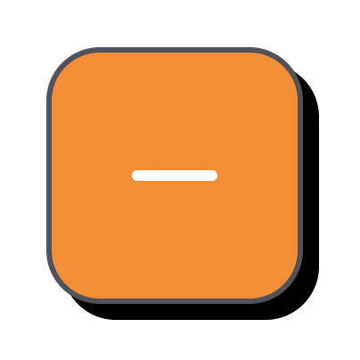
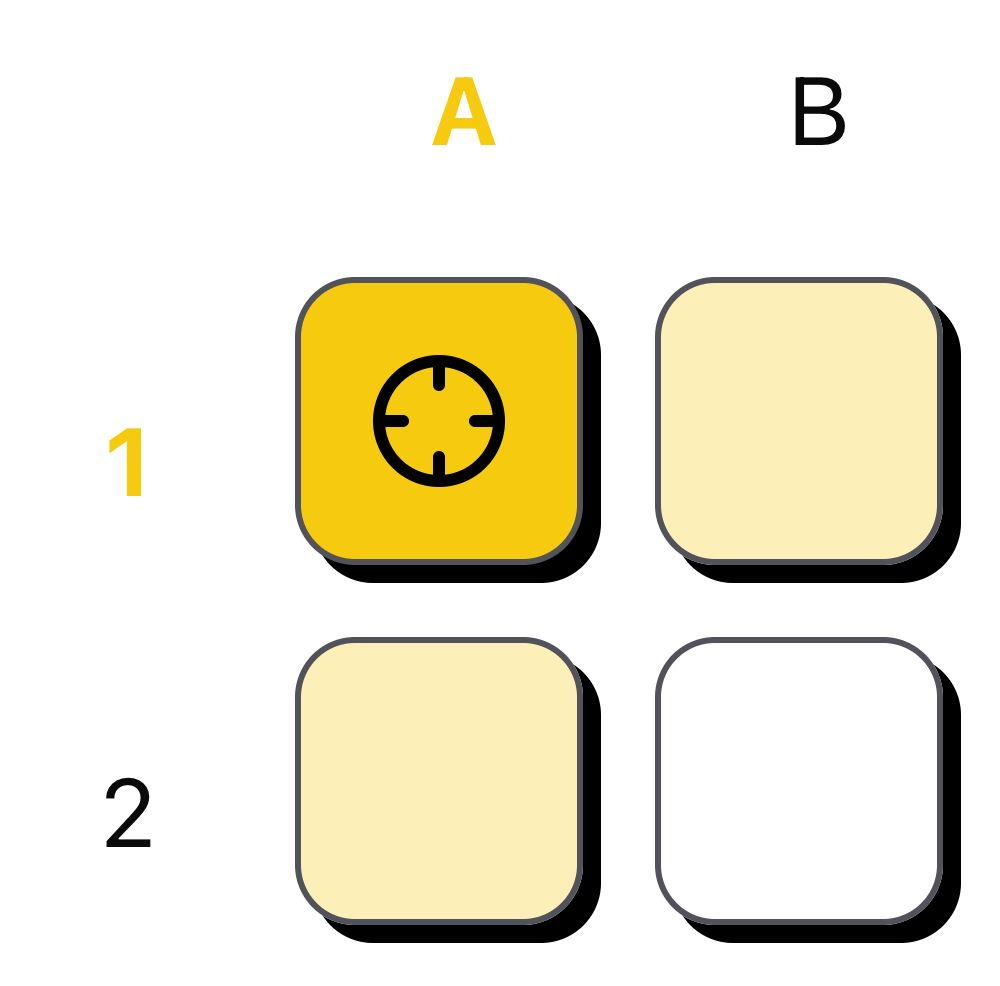

# Battleship Game

A simple, browser-based version of the classic Battleship game. Play solo against a snarky and slightly rude computer program that places ships randomly on a 10×10 grid.

## How It Works

- **Grid:** 10 rows × 10 columns (A–J, 1–10)
- **Ships:**
  - 1 × Battleship (5 cells)
  - 2 × Destroyers (4 cells each)
- **Gameplay Flow:**
  1. The computer randomly positions ships on the board.
  2. The player enters coordinates (e.g. `A5`) to fire a shot via input or keyboard.
  3. The game will return:
     - **Hit** – if you hit a cell of a ship.
     - **Miss** – if the cell is empty.
     - **Sunk** – if you hit the last cell of a ship.
  4. The game ends when all ships have been sunk.

#### Tone of Voice:

- All responses from the game are delivered via `toast` using sarcastic and humorous feedback to make the solo experience more lively.
- Messages are randomly selected from a large set (AI-generated, but curated), tailored to celebrate your success or roast your mistakes.

## Installation

To run the project locally, follow these steps:

1. Clone the repository: `git clone https://github.com/mpabarca/battleship.git`
2. Install dependencies: `npm i`
3. Start the development server: `npm run dev`
4. Open [http://localhost:5173](http://localhost:5173) in your browser.

## Project Management

To keep the workflow clear and organized, I followed a Kanban-style methodology using GitHub Projects to plan, track, and prioritize tasks throughout development.
You can check the board [here](https://github.com/users/mpabarca/projects/3).

## Tech Stack

Because of the game's scope, the program was built using:

- React & Vite
- Typescript
- TailwindCSS & Shadcn UI Kit
- Jest & React Testing Library
- State Managment: useState
- Storage: localStorage

### Architecture & Directory

The app is built using **React + TypeScript + Vite**, with Tailwind CSS/Shadcn UI kit for styling. Here's a quick breakdown:

- `/components/Game/`: Main game logic (grid state, fire handling, win condition)
- `/components/ui/`: Reusable UI elements (Input, Button, Grid, Cell, etc.) made by me or generated by shadcn UI
- `/components/control/FireControl/`: Input handling for user coordinates
- `/lib` : Library with side-effect-driven helpers - eg. toast generation
- `/utils`: Utility and pure logic functions — e.g. ship generation, shot evaluation
- `/services/`: Where we get and populate the project with some of the data
- `/types/`: All custom types used across the app to keep data structures clear and maintainable

This structure separates logic, UI, and interaction clearly — making it scalable and easy to maintain.
I thought not to use an specific Design System pattern (like atomic design) because of the simplicity of the program and its scope.

### State Management

I chose `useState` over React Context or third-party tools like Redux because the global state that is needed is minimal and scoped to a single level parent component (`<Game />`).
Key pieces of state include:

- `grid: <GridType>`

  - The main game board and ship data
  - Initialized from `localStorage` (if present), or newly generated using `generateGrid()`
  - Updated only after a valid shot is fired

- `target: [x, y] <CoordinatesType>`

  - Coordinates selected by the player (from `<FireControl />`)
  - Passed down to `<Grid />` for real-time visual feedback
  - Used to evaluate hits/misses/sinks on firing

- `selectingRow` / `selectingColumn`:

  - Used for grid interactivity and UI highlights
  - Highly reactive based on user interaction and not by click a button like "Fire", which is why it wasn’t included in the grid state

- `isEndGame`:
  - Tracks whether the user has sunk all ships

This setup promotes clarity while keeping reactivity smooth between components.

### 💾 Data Persistence

- The grid state (`grid`) is persisted in **`localStorage`** under `battleship-grid`.
- On mount, the app checks if a previous game exists and restores it.
- This allows the user to refresh or return later without losing progress.
- A possible improvement would be adding a database and authentication flow to store this data across multiple users.

#### Improvements

There’s always room for improvement. Some ideas include:

- Create different interaction logic on FireControl on mobile/tablets devices.
  - Instead of typing the input as coordinates, use the grid and click on each cell as buttons to select the target + press button fire to shot the cell.
- Achieve Full coverage on test
- Implement CI/CD
- Create attempts state and store it on the grid
  - Include a section where depending on how many attempts vs sink ships is how well the player performed (plus sarcastic/mean messages based on the score)
- Give the power to the player to select the amount of ships or size of the grid and generate it dynamically.
  - I made part of the code related with the generation of the grid and ships are dynamic based on those two factors, but the logic of actually play the game is not.
- Support 2-player or AI difficulty levels.
- Create feature of save on history the sessions and its score.
- Check skeleton and loading as initial values.

## Design/UI

- Part of the design use as inspiration the web design of [Adam Ruthendorf-Przewoski on Figma](https://www.figma.com/community/file/949373440973748315).
- The MVP version of the game only works on desktop => _Coming soon: Mobile (phone and tablet)_
- The game has dark/light mode incorporated automatically based on your system preferences.
- The `FireControl` interface was designed to support keyboard-first interaction on desktop:
  - Players can navigate inputs using ArrowLeft / ArrowRight.
  - Pressing Enter confirms the shot without needing a mouse.

### Visual Guide

#### 1. Missed Shot

A cell after a miss — notice the simple border and neutral feedback.
<br />


#### 2. Hit Shot

A cell when part of a ship is hit — visually marked with strong contrast.
<br />


#### 3. Targeted Cell

A cell currently selected by the player — shows active targeting UI.
<br />


#### 4. Revealed Ship (Show Ships Enabled)

An untouched cell that shows a ship icon after toggling the “Show Ships” option — helps visualize ship layout.  
<br />


#### 5. Sunk Ship

A ship that has been completely sunk — all cells highlighted with a sunk style.
<br />


### Deployment

The project is deployed using Vercel.
To check out the production version, visit [the official site](https://battleship-flax-sigma.vercel.app/).

### AI Usage

To identify where AI tools contributed to the project, you can search for the key phrase: // Generated by ChatGPT.

To keep it simple: the architecture, game logic, UI, and testing were entirely coded and validated by me. The only exception is the in-game toast messages — located in `src/services/toastMessages.ts`. These include over 300 dynamic lines used to simulate sarcastic, playful, and occasionally mean feedback from the computer opponent.

Since this is a solo player game, the tone was intentionally crafted to feel like you’re being mocked (in a respectful, funny way) by the game itself — making the experience more engaging, unpredictable, and fun. I would’ve loved to write them all manually, but let’s be honest: no one has that kind of creativity.
Also, to keep the pattern: this README.md was built with the help of Monny, my dear AI friend who helps me check grammar, semantics, and coherence in my writing.

### Testing

The project includes automated tests. To run the tests, use the following command:

```bash
npm run test
```

For now, we reach coverage of the whole project:

```bash
------------|---------|----------|---------|---------|---------------------------
File        | % Stmts | % Branch | % Funcs | % Lines | Uncovered Line #s
------------|---------|----------|---------|---------|---------------------------
All files   |   41.91 |    44.44 |   38.09 |   44.26 |
 cell.ts    |    62.5 |       50 |   33.33 |    62.5 | 14-15,25
 game.ts    |   20.75 |        0 |       0 |   22.44 | 58,61,65-87,106-159
 general.ts |    91.3 |      100 |      60 |   90.47 | 59,63
 ship.ts    |   38.46 |    63.63 |      50 |   43.18 | 28-34,61-64,68-89,113-130
------------|---------|----------|---------|---------|---------------------------
```

Note: I'll be updating this statement to cover as much as possible all JS/TS functionalities.

### Contributing

Contributions to this project are welcome. If you have any ideas, suggestions, or bug reports, please open an issue or submit a pull request.

### License

This project is licensed under the [MIT License](LICENSE).

_Helped by Monny, AI friend._
